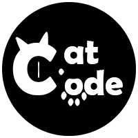

<!--suppress HtmlDeprecatedAttribute -->

    
    <h3>
        - simpler-robot -
    </h3>
    
        <a href="https://github.com/ForteScarlet/simpler-robot" target="_blank">github</a>
     
    &nbsp;&nbsp; | &nbsp;&nbsp;
    
        <a href="https://gitee.com/ForteScarlet/simpler-robot" target="_blank">gitee</a>
      
    <small> &gt; 感谢 <a href="https://github.com/ForteScarlet/CatCode" target="_blank">CatCode</a> 开发团队成员制作的simbot logo &lt; </small>
     
    <small> &gt; 走过路过，不要忘记点亮一颗⭐喔~ &lt; </small> 
     

   

   
   
   
   
   
   
   
   
   
    

## 简介

这是一个通用机器人开发框架，是simple-robot(下文简称`simbot`)的2.x版本。

`simbot` 是一个JVM平台的通用机器人开发框架，基于simbot核心API并对接开发不同平台的机器人应用，你可以使用相同的代码风格来开发不同平台的机器人。

`simbot` 对于一些主要组件专门提供了springboot-starter模块以方便开发者快速整合springboot（当然，如果可以，我依旧更希望你使用原生simbot环境）。

`simbot` 提供了丰富的api接口与各种模块以支持机器人开发者与组件开发者使用，对于机器人开发者，你可以通过功能丰富的注解来实现各种较为复杂的事件匹配逻辑。对于组件开发者，你拥有很高的可选择性与灵活性来针对一个平台进行对接。

以及更多高级特性等待你的发现...

 

[QQ交流群](https://jq.qq.com/?_wv=1027&k=1Lopqryf)

 

旧版本考古 -> [simple-robot 1.x](https://github.com/ForteScarlet/simple-robot-core)

## 支持平台

目前支持的机器人平台：
- QQ
    - [mirai](https://github.com/mamoe/mirai)
- wechat
    - [可爱猫](http://www.keaimao.com.cn/)

计划中准备支持的平台：
- QQ
  - onebot(QQ机器人通用协议) ([分支](https://github.com/ForteScarlet/simpler-robot/tree/component-onebot-dev)开发中 *暂缓*)
- [开黑啦](./component/component-kaiheila-parent) ([分支](https://github.com/ForteScarlet/simpler-robot/tree/kaiheila-dev)开发中)
- telegram
- discord
- 钉钉
  - 企业内建应用事件
  - 企业内建群BOT

## 文档

simpler-robot文档：https://www.yuque.com/simpler-robot/simpler-robot-doc

## Demo
前往 [simbot-demos](https://github.com/simple-robot) 寻找并使用你所需要的demo，或通过pl协助我们完善demo。

## 新特性
既然是相对于1.x版本的新版本，那么必然会有更优异的特性。

- 更明确的实例定义。不再将较为混乱的各种方法堆在事件中，而是使用**容器**将他们整齐归类。
- 更好的消息构建。提供更多的消息发送方式来适应各种场景下的消息发送效率。
- 更高的效率。知识是需要沉淀的。每一次的版本更新都会比以往更多的考虑效率问题。
- 更好的日志。日志整合`slf4j`api，可以无缝兼容其他任意`slf4j`下的日志框架。  
- 更灵活的开发。降低核心、组件之间的强耦合，更多的借助IOC模块实现更灵活的开发与拓展。
- 更灵活的配置。支持`properties`、`yaml` 类型配置的解析，同时也支持指定特定启动参数、通过网络获取在线配置文件等多种方式。  
- 更灵活的事件监听。优化核心注解`@Listen`的使用。
- 更灵活的事件过滤。优化核心注解`@Filter`的使用。
- 分工更明确的模块。核心、组件、序列化、http客户端、定时任务...各司其职，并提供丰富地实现模块来减少你的项目冗余依赖量。
- 更好的问题反馈。所有的官方模块都会汇总于此。开启一个 [issue](https://github.com/ForteScarlet/simpler-robot/issues) 来反馈问题的效率远远高于在群里茫然的提问。
- 以及更多...

## 其他模块

simpler-robot所独立的公共模块项目：
- github: https://github.com/ForteScarlet/forte-common

simpler-robot所使用的特殊码CatCode：
- github: https://github.com/ForteScarlet/CatCode
- gitee : https://gitee.com/ForteScarlet/CatCode

## 快速开始

文档-快速开始：https://www.yuque.com/simpler-robot/simpler-robot-doc/qeyorq

## 极简示例
查看 [极简示例](document/simple-show.md)

## 协助我
- 你可以通过 [pr](https://github.com/ForteScarlet/simpler-robot/pulls "pull request") 为项目代码作出贡献。
- 你可以通过 [issue](https://github.com/ForteScarlet/simpler-robot/issues "issues") 提出一个建议或者反馈一个问题。
- 你可以通过 [讨论区](https://github.com/ForteScarlet/simpler-robot/discussions "discussions") 与其他人或者simbot开发团队相互友好交流。
- 如果你通过此项目创建了一个很酷的项目，欢迎通过 [issue](https://github.com/ForteScarlet/simpler-robot/issues) 、[讨论区](https://github.com/ForteScarlet/simpler-robot/discussions)
  等方式联系团队开发人员，并将你酷酷的项目展示在作品展示区。

## 捐助我
如果你喜欢这个项目，不妨试着 [捐助](https://www.yuque.com/docs/share/43264d27-99a7-4287-97c0-b387f5b0947e) 一下我们，十分感谢。

## 特别鸣谢

感谢 [jetbrains](https://www.jetbrains.com/?from=simpler-robot "jetbrains") 为团队提供的免费授权，也希望大家能够支持jetbrains及其产品，支持正版。

*****

感谢 [猫猫码](https://github.com/ForteScarlet/CatCode "CatCode") 为本项目提供支持并绘制项目LOGO。

## 贡献你的星星！
