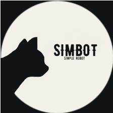

<!--suppress HtmlDeprecatedAttribute -->

<div align="center">
    
    <h3>
        - simpler-robot -
    </h3>
    <span>
        <a href="https://github.com/ForteScarlet/simpler-robot" target="_blank">github</a>
    </span> 
    &nbsp;&nbsp; | &nbsp;&nbsp;
    <span>
        <a href="https://gitee.com/ForteScarlet/simpler-robot" target="_blank">gitee</a>
    </span> <br />
    <small> &gt; 感谢 <a href="https://github.com/ForteScarlet/CatCode" target="_blank">CatCode</a> 开发团队成员制作的simbot logo &lt; </small>
    <br>
    <small> &gt; 走过路过，不要忘记点亮一颗⭐喔~ &lt; </small> 
    <br>
   <a href="https://github.com/ForteScarlet/simpler-robot/releases/latest"></a>
<a href="https://repo1.maven.org/maven2/love/forte/simple-robot/component-kaiheila-parent/" target="_blank">
  </a>
<a href="https://oss.sonatype.org/content/repositories/snapshots/love/forte/simple-robot/component-kaiheila-parent/" target="_blank">
  </a>
<a href="https://www.yuque.com/simpler-robot/simpler-robot-doc" target="_blank">
  </a>
   <hr>
   
   
   
   
   
   
   
   <a href="../../LICENSE"></a>
    </div>


## 简介

### simple-robot简介

☞ [simple-robot](../../README.md)

### 开黑啦组件简介

这是一个对接 [开黑啦平台](https://www.kaiheila.cn/) 的机器人开发框架，是实现了simple-robot(下文简称`simbot`)标准API的通用开发框架。

开黑啦组件提供多个模块来支持开发者开发一个开黑啦bot应用或第三方框架。


## 模块简介

- [核心模块 kaiheila-core](kaiheila-core)

  核心模块提供针对于 [开黑啦开发者平台](https://developer.kaiheila.cn/doc) 以及 [simbot-标准API模块](../../core-api/api) 进行封装，提供一套实现了simbot-api的标准开黑啦标准库。
  其中包括对于[事件](https://developer.kaiheila.cn/doc/event)、[KMarkdown](https://developer.kaiheila.cn/doc/kmarkdown)、通用api标准等基础信息的封装。


- `api模块 component-kaiheila-api-v$version`

  api模块提供针对于 [开黑啦http接口api](https://developer.kaiheila.cn/doc/reference) 的对应版本的封装。

上述其他模块以针对开黑啦为主，面向开黑啦框架、第三方组件等开发者。


- `标准模块 component-kaiheila`

  标准的开黑啦-simbot组件模块，基于上述其他模块以外，整合 [simbot-core](../../UPDATE.MD) 并实现完整的simbot功能，面向bot应用开发者。


## ⚠️ 注意
目前的v3-api模块较为完整可用，其他模块在 `simbot-3.x` 问世之前将不会大幅度更新。
且在 `simbot-3.x` 问世前，开黑啦组件下的各模块不会发布**正式版本**。

不过对于例如 `v3-api` 这种与simbot无关的api模块，你依然可以使用，并欢迎提供反馈与建议。

<hr>
对于其他模块，针对 **事件** 的封装、ws协议的消息接收与基础事件监听实际上也已经可以正常使用了，
但是暂未实现短线重连等机制。

这方面的问题，我暂时尚未提供文档（因为不够完善）。如果你有兴趣使用或者协助我，抑或是仅供参考，可以通过issue、讨论区进行讨论，或者加入群聊向我联系。

<hr>

未来开黑啦组件可能会脱离当前仓库，使用独立仓库进行管理。

<br>

## 使用
```xml
<!-- 开黑啦 V3 API组件 -->
<dependency>
    <groupId>love.forte.simple-robot</groupId>
    <artifactId>component-kaiheila-v3</artifactId>
    <version>0.0.1-PREVIEW</version>
</dependency>
```


## 文档

TODO

## 简单示例

### API-V3
API组件中，提供了针对于官方的大部分客户端请求API的基础封装，比如：
```kotlin
 @Test
    fun listTest() = runBlocking {
        val guildId = "1145141919810" // GuildApiTest().guildList().items[0].id

        val client = HttpClient() // ktor client
        val token = "token"

        val data: ListResp<ChannelInfo, ApiData.Resp.EmptySort> = ChannelListReq(guildId).doRequest(V3, client, token)

        println(data)

        println("-0-")

        data.forEach { it: ChannelInfo -> 
            println(it)
        }
    }
```
其中，`ChannelListReq` 即为对于 `/channel/list` 接口的封装。
所有的api请求实例均为此类的命名方式。

在得到 `xxxReq` 实例后，可以通过顶层函数 `xxxReq.doRequest(client, token)` 发送api请求，并得到响应值。
列表类型的响应值类型如上面所示，是一个 `ListResp<DATA, SORT>` 实例。其中，`DATA` 便是每个元素的实例，`SORT` 则为排序参数的响应（如果有的话）。

