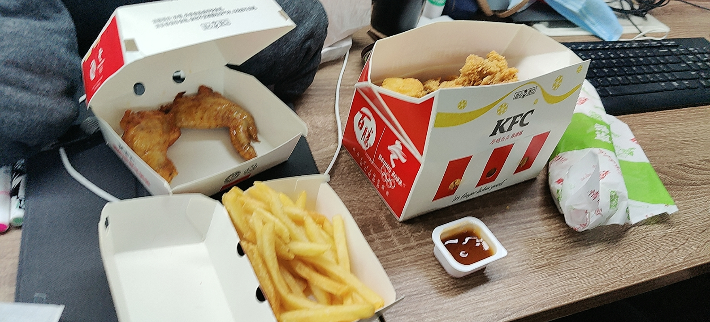
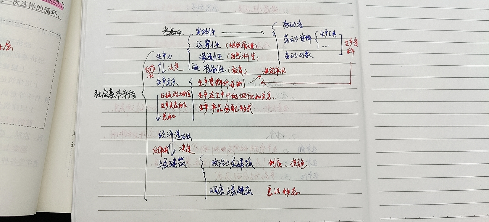

2022年第13周周报喵。

<!--truncate-->

这周(以及未来可能的几周)由于下面的复习原因，可能并没有太多的什么针对于 [Simple Robot](https://github.com/simple-robot/simpler-robot) 相关信息或者进展。

不过嘛。。这周报可从来没有说过这是专供于simbot的周报喔？

<small><i>等了1小时才出餐的疯狂星期四</i></small>

## 👑 QQ群要闻
在今天 (2022/4/1)，我们正式推举集可爱、美貌、智慧为一体的**法欧莉**女士，也就是我，作为新的群主！
希望大家能够在新群主的带领下和谐共处，快快乐乐度过每一天！

## 📖 文档进度
十分可惜的是，这周的工作比较繁忙，加上又抽出了一些时间来进行复习，不论是组件、核心还是文档的迁移进度都有所停滞。
不过停滞归停滞，多少还是有一点儿进度的。这周我们迁移来的文档内容有：
- **基础内容 - 持续会话** 
- **基础内容 - 核心事件处理器**

目前来讲，文档内的大部分内容已经与 [语雀文档](https://www.yuque.com/simpler-robot/simpler-robot-doc) `simbot3`
章节内的东西接近一致。
尚未迁移的内容还有如下大致内容：
- **标准定义-拦截器** (对应语雀文档的[定义概述-拦截器](https://www.yuque.com/simpler-robot/simpler-robot-doc/gg762t))
- **标准定义-参数绑定器** - Binder (对应语雀文档的[参数绑定器 - Binder](https://www.yuque.com/simpler-robot/simpler-robot-doc/mnxvam)) 
    <small><small><small><i>虽然语雀里这一章节也是空的</i></small></small></small>
- 部分组件相关的详细内容

这周更新文档的时候，还顺便在本站点埋下了一点点小小的彩蛋。不知道你能发现多少小细节呢～？  
<small><small><small><small><small><small>
<i>贴心提示：大部分彩蛋和小细节都存在于首页中。</i>
</small></small></small></small></small></small>

## 💬 计划与讨论
有些时候，当我们对于部分API的调整有所想法的时候，会将想法发布至 [讨论区](https://github.com/simple-robot/simpler-robot/discussions) 
以供与大家讨论并得到结果。讨论在一定时间内没有新的观点后将会被固定结果。

如果你有好的想法，也完全欢迎在 [讨论区](https://github.com/simple-robot/simpler-robot/discussions) 分享讨论喔！

## 📚 复习
继续十分痛苦但是充满偷懒的复习4月份要考试的东西。😢  

<small>

*这可能是我从初中以来学习最认真的时候了。*

*但是这解决不了时间紧迫的问题。一共四科要考，我才只看了一科半...*

</small>

