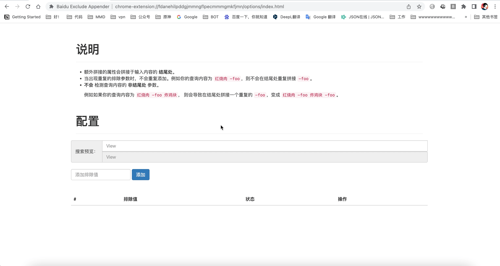
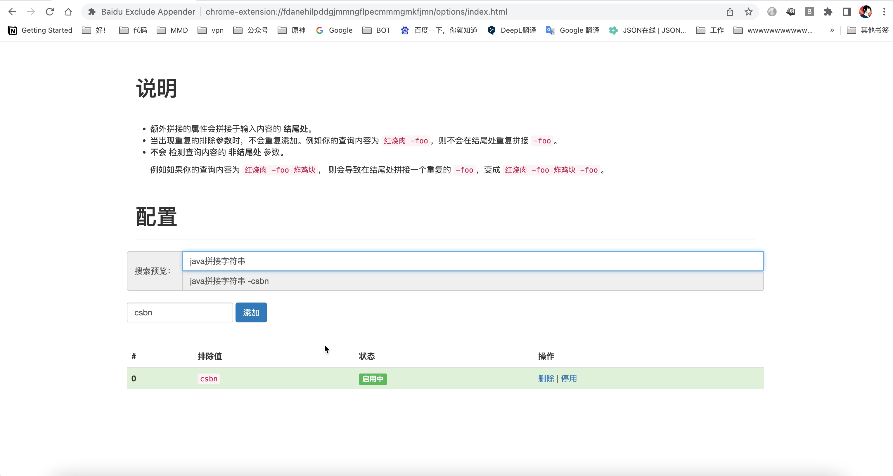

2022年第14周周报喵。

<!--truncate-->

## 🍹 组件更新
鉴于考试延期，这周简单摸了摸鱼没有复习，转而去更新了一下组件相关的内容。

### 开黑啦组件
在上个版本（[v3.0.0.preview.5.0-0.0.2](https://github.com/simple-robot/simbot-component-kaiheila/releases/tag/v3.0.0.preview.5.0-0.0.2)）
中，基本完整的实现了开黑啦的标准库相关模块，并针对标准库提供了针对于simbot标准事件中的**消息事件**的实现。
也就是说在上个版本中，你可以通过simbot的标准写法来监听开黑啦事件中的好友消息与频道消息了。

而这周，将会发布一个新的版本 [v3.0.0.0.preview.1.0](https://github.com/simple-robot/simbot-component-kaiheila/releases/tag/v3.0.0.0.preview.1.0) 来提供更丰富的simbot标准事件的实现。
本周计划会提供：
- 成员进出频道
- 成员加入/离开频道服务器
- bot自己加入/离开频道服务器
- 频道增减、变动相关

等事件的实现。当然，也许还会有计划外的额外实现喔～

~~我之前还计划优先实现与 **请求** 有关的事件呢（比如加入频道申请），结果突然发现压根没有这类的事件 😶~~。

### Mirai组件
本周的重点在于开黑啦组件，因此Mirai组件没有什么很大的更新内容。
目前Mirai组件最近的**更新计划**是提供针对于 **头像戳一戳** 的事件/消息对象 等内容的实现与完善。 

### 腾讯频道组件
腾讯频道组件前一段事件似乎更新了不少新的事件呢，其中也包括了**私聊**相关的事件，因此对私聊事件的实现也会加入到未来的更新计划中。

不过嘛，不会是这周啦。

### 核心
除了组件以外，实际上核心需要更新的东西也挺多的.... 基础的simbot核心内容这周提供了 `v3.0.0.preview.6.0-SNAPSHOT` 的版本，
由于仅是快照版本，因此没有也不会发布公告一类的东西啦。

`pre.6.0` 的快照目前的变动主要是对一些事件的泛型定义调整以适应上述开黑啦组件的更新。

至于核心部分其他的更新计划，那可多了去了，这么多坑，慢慢填啦 🐟。

## 🧩 Baidu Exclude Appender
你还在因为百度搜索经常出来各种各样没头没尾的"Copy"帖子而苦恼吗？
快来试试这个谷歌浏览器插件 [Baidu Exclude Appender](https://github.com/ForteScarlet/baidu-exclude-appender) 吧！
配置你想要排除掉的站点，让它们远离你的视线！🚫

好吧，闲暇之余，我发现了一个小巧的chrome浏览器插件: [Baidu Exclude Appender](https://github.com/ForteScarlet/baidu-exclude-appender) 。
如果你有这方面的需求，那么不妨看一看，如果对你有帮助，不妨给作者的GitHub点个星星、谷歌商店送给5🌟好评吧！

## 🚨 群规修订
[群规细则](/group-rule) 有所修订，在 **红线** 中增加了一个有关于 **拱火** 的条目。 
我觉得红线内的东西都没什么好解释的，总而言之大家要严格遵守、和谐共处喔～

> *不会拱火的人永远不会去拱火，想要拱火的人终究会拱火。*

## 📚 复习
似乎我们地区的考试延期至下半年了。也算是个好消息吧，至少对我来说。📝

