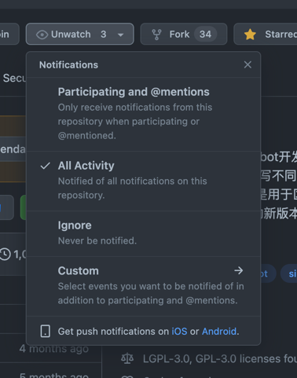

2022年第25周周报喵。

<!--truncate-->

import Tabs from '@theme/Tabs';
import TabItem from '@theme/TabItem';
import CodeBlock from '@theme/CodeBlock';

## 📰 资讯订阅
即日起，我们将**不会**在其他任何额外的地方（例如各社交软件）中发布我们的任何更新功能、讯息 （例如版本更新、周报更新等）。

如果你希望能够第一时间得到我们的**版本更新**通知或者其他仓库相关信息的通知，可以前往你所需要订阅的仓库
（例如 [核心库](https://github.com/simple-robot/simpler-robot)）处，使用仓库右上角的 **Watch** 按钮来订阅你想要订阅的内容。

。

:::info 通知范围

你可以灵活的调整 **Watch** 后需要给你推送的通知范围。

:::

同样的，**周报**也不会再从任何地方发布更新公告或通知。如果你想关注我们的**周报**，则在对应时间来查看是否更新即可。

我们通常会在 **周五的18:00之前** 发布周报。当然，如果出现特殊情况也可能会导致周报停更、延更。如果出现这种问题，或者你有什么想要与我们讨论的，
都可以前往 [Simbot3 Website仓库](https://github.com/simple-robot-library/simbot3-website) 
的 [**Discussions**](https://github.com/simple-robot-library/simbot3-website/discussions) 催更、询问、交流。

## 💬 群聊与其他
也许你已经发现了，现在simbot不再拥有**任何官方群聊**。现在唯一能够与团队成员交流的地方就是
[**GitHub仓库**](https://github.com/simple-robot/simpler-robot) 中的相关场所，
例如 [**Issues**](https://github.com/simple-robot/simpler-robot/issues)
或者 [**Discussions**](https://github.com/simple-robot/simpler-robot/discussions)。

后续simbot版本进入 **`beta`** 阶段后，也会逐步完善对于仓库的整体建设，包括对于问题、贡献、工作流等内容的更加标准化的改进。
在第一个稳定版发布后，也许还会根据心情继续更新一下视频之类的东西，谁知道呢。

## 🚀 版本更新
从[上次周报](../06-17-week-24-report)截止到本次周报，[核心库](https://github.com/simple-robot/simpler-robot) 发布了如下几个版本：
- [**v3.0.0.preview.16.0**][v3.0.0.preview.16.0] 
- [v3.0.0.preview.15.0][v3.0.0.preview.15.0] 

而现在，也快到了由法欧莉亲自对当前的版本（[v3.0.0.preview.16.0][v3.0.0.preview.16.0] ）进行测试的环节了。

[v3.0.0.preview.15.0]: https://github.com/simple-robot/simpler-robot/releases/tag/v3.0.0.preview.15.0
[v3.0.0.preview.16.0]: https://github.com/simple-robot/simpler-robot/releases/tag/v3.0.0.preview.16.0

## 📖 文档更新
文档最近两周内并没有什么实质性的进展。也许下周可以继续呢？

## 💧 水文
最近终于又在部分平台上发了一片随手写的水文：《项目屎山化方案大全》，如果有兴趣的话可以去 [**掘金**](https://juejin.cn/post/7111609522933743646)
或者我的 [**微信公众号**](https://mp.weixin.qq.com/s/4t5PPVo5Ca5b-xiVE-6BmA) 中阅读喔～

当然，如果你有兴趣，也欢迎扫描下方二维码关注我这个随缘更新的公众号喔～

