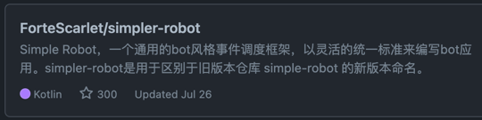

2022年第30周周报喵。

<!--truncate-->

import Tabs from '@theme/Tabs';
import TabItem from '@theme/TabItem';
import CodeBlock from '@theme/CodeBlock';
import Label from '@site/src/components/Label'

早上好。也许是中午？那么就是晚上好。不知不觉已经进入到了今年的第30周了，而这周，又发生了什么大事儿呢？

实际上基本上没有。

## 🚀 版本发布

在本周，我们几位核心成员忙里偷闲的为 [核心库][core-repo] 
发布了一个新的版本：[**v3.0.0-beta-RC.1**](https://github.com/simple-robot/simpler-robot/releases/tag/v3.0.0-beta-RC.1)

这是第一个 **`RC`** 版本，这也代表从此版本开始，api将会被尽可能的保证不发生重大变化了。
这是个好消息，不是吗？

除了 [核心库][core-repo] 以外，如果不出意外，可能还会为 [mirai组件](https://github.com/simple-robot/simbot-component-mirai)
发布一个新版本：`v3.0.0.0-beta-M2`。

## 🌟 星星！

就在刚刚，我们 [核心库][core-repo] 的 **star** 量终于达到了 **300** ！可喜可贺，可喜可贺～

> <small>哦好吧，也许不是刚刚?</small>

[core-repo]: https://github.com/simple-robot/simpler-robot
