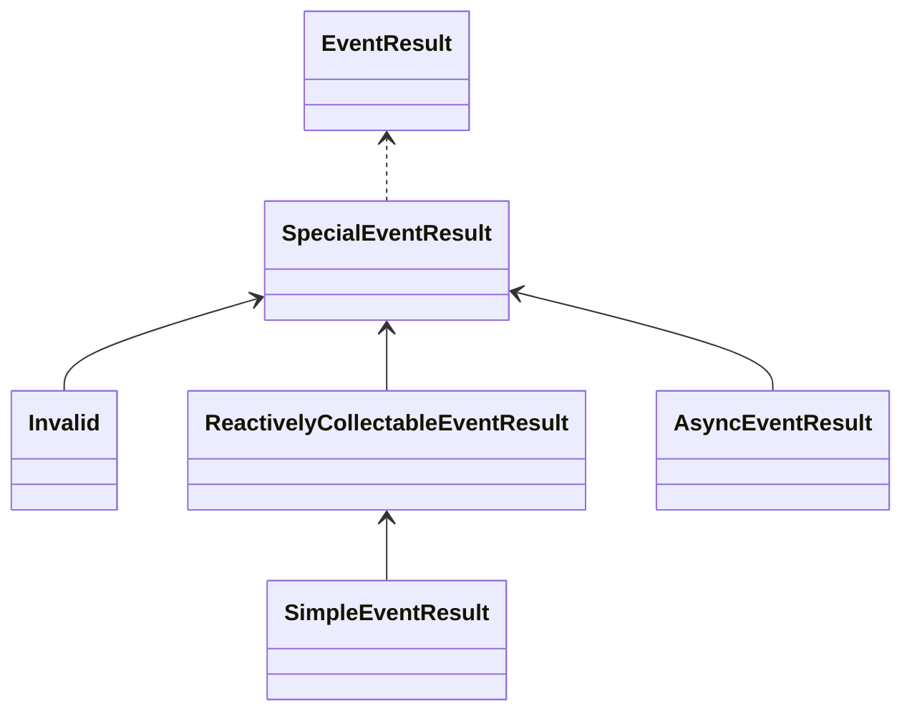

import Label from '@site/src/components/Label'
import Tabs from '@theme/Tabs';
import TabItem from '@theme/TabItem';

监听函数，用于承载对事件的处理逻辑。


## 监听函数

### 定义

让我们来了解一下什么是**监听函数**。下面是监听函数（有所简化）的基本定义：

```kotlin
public interface EventListener : ... {
    /** 检测某事件类型是否为当前事件所需要的类型 */
    public fun isTarget(event: Event.Key<*>): Boolean
    
    /** 对事件进行匹配 */
    public suspend fun match(context: EventListenerProcessingContext): Boolean

    /** 如果 [match] 匹配成功，处理此事件并得到一个结果 */
    public suspend fun invoke(context: EventListenerProcessingContext): EventResult
    
    // 其他...
}
```

可以看得出来，对于一个监听函数，其主要存在两个基本功能，就是对事件的匹配和事件的处理。
这其中，“事件的匹配”被分为了两个步骤。

如果用代码来表示一次事件的处理，那么它大概是如下的效果：

```kotlin
val eventContext = ...

val listener = ...

if (listener.isTarget(eventContext.event.key) && listener.match(eventContext)) {
    return listener.invoke(eventContext)
} else {
    return EventResult.invalid()
}
```

:::info Context?

有关 `EventProcessingContext`（和 `EventListenerProcessingContext`） 的信息可参考[**事件处理上下文**](../definition/event-overview/event-processing-context)。

:::

### 实现

既然知道了监听函数的定义，那么我们便可以通过任意一个自定义类型来实现它。

我们以监听**好友消息事件**为例，创建一个当好友发送"在吗"时回复"在的"的监听函数。

<Tabs groupId="code">
<TabItem value="Kotlin">

```kotlin
class MyListener : EventListener {
    override fun <T : Any> getAttribute(attribute: Attribute<T>): T? = null
    
    /**
     * 事件类型匹配
     */
    override fun isTarget(eventType: Event.Key<*>): Boolean = eventType isSub FriendMessageEvent
    
    /**
     * 事件匹配
     */
    override suspend fun match(context: EventListenerProcessingContext): Boolean {
        return "在吗" == context.textContent?.trim()
    }
    
    /**
     * 事件处理
     */
    override suspend fun invoke(context: EventListenerProcessingContext): EventResult {
        (context.event as FriendMessageEvent).reply("在的")
        return EventResult.defaults()
    }
}
```

</TabItem>
<TabItem value="Java">

:::caution 挂起与阻塞

当通过Java实现 `suspend` 函数的时候，函数参数中会多一个 `Continuation<? super xxx> $completion` 参数。
**理论上**来讲，你可以考虑无视它，并直接开始你的阻塞式逻辑。这大概是可行的，
这会使得这个函数本质上仍旧是阻塞函数。

不过需要注意，这时候函数的返回值会变成 `Object`. 但是你实际返回的内容仍然要与正确的函数定义相吻合。

:::

```java
public class MyListener implements EventListener {

    @Nullable
    @Override
    public <T> T getAttribute(@NotNull Attribute<T> attribute) {
        return null;
    }

    /**
     * 事件类型匹配
     */
    @Override
    public boolean isTarget(@NotNull Event.Key<?> eventType) {
        // 判断目标是否为 '好友消息事件'
        return Event.Key.isSub(eventType, FriendMessageEvent.Key);
    }

    /**
     * 事件匹配
     */
    @Nullable
    @Override
    public Object match(@NotNull EventListenerProcessingContext context, @NotNull Continuation<? super Boolean> $completion) {
        String textContent = context.getTextContent();
        if (textContent == null) {
            return false;
        }

        return textContent.trim().equals("在吗");
        // return type: boolean, non-null
    }

    /**
     * 事件处理
     */
    @Override
    public Object invoke(EventListenerProcessingContext context, Continuation<? super EventResult> continuation) {
        ((FriendMessageEvent) context.getEvent()).replyBlocking("在的");
        return EventResult.defaults();
        // return type: EventResult, non-null
    }
}
```

</TabItem>
</Tabs>


当然，在这过程中，你可能会发现一些问题，比如匹配完成后还需要在 `invoke` 中进行类型转化等，
这显然并不是一个很好的类型安全方案。但是当然，解决这个问题最快的办法就是将所有的逻辑都放到 `invoke` 中，
一气呵成：

<Tabs groupId="code">
<TabItem value="Kotlin">

```kotlin
class MyListener : EventListener {
    override fun <T : Any> getAttribute(attribute: Attribute<T>): T? = null
    
    /** 事件类型匹配，无逻辑，直接得到true */
    override fun isTarget(eventType: Event.Key<*>): Boolean = true // eventType isSub FriendMessageEvent
    
    /** 事件匹配，无逻辑，直接得到true */
    override suspend fun match(context: EventListenerProcessingContext): Boolean = true
    
    /** 事件处理 */
    override suspend fun invoke(context: EventListenerProcessingContext): EventResult {
        context.event.let { event ->
            if (event is FriendMessageEvent && "在吗" == context.textContent?.trim()) {
                event.reply("在的")
                return EventResult.defaults()
            }
        }
        
        // 没有匹配成功
        return EventResult.invalid()
    }
}
```

</TabItem>
<TabItem value="Java">

:::caution 挂起与阻塞

当通过Java实现 `suspend` 函数的时候，函数参数中会多一个 `Continuation<? super xxx> $completion` 参数。
**理论上**来讲，你可以考虑无视它，并直接开始你的阻塞式逻辑。这大概是可行的，
这会使得这个函数本质上仍旧是阻塞函数。

不过需要注意，这时候函数的返回值会变成 `Object`. 但是你实际返回的内容仍然要与正确的函数定义相吻合。

:::

```java
public class MyListener implements EventListener {

    @Nullable
    @Override
    public <T> T getAttribute(@NotNull Attribute<T> attribute) {
        return null;
    }

    /**
     * 事件类型匹配，无逻辑，直接得到true
     */
    @Override
    public boolean isTarget(@NotNull Event.Key<?> eventType) {
        return true;
        // return Event.Key.isSub(eventType, FriendMessageEvent.Key);
    }

    /**
     * 事件匹配，无逻辑，直接得到true
     */
    @Nullable
    @Override
    public Object match(@NotNull EventListenerProcessingContext context, @NotNull Continuation<? super Boolean> $completion) {
        return true;
    }

    /**
     * 事件处理
     */
    @Override
    public Object invoke(EventListenerProcessingContext context, Continuation<? super EventResult> continuation) {
        Event event = context.getEvent();
        if (event instanceof FriendMessageEvent
            && "在吗".equals(trim(context.getTextContent()))) {

            ((FriendMessageEvent) event).replyBlocking("在的");
            return EventResult.defaults();
        }


        return EventResult.invalid();
        // return type: EventResult, non-null
    }

    private static String trim(String nullableValue) {
        return nullableValue == null ? null : nullableValue.trim();
    }
}
```

</TabItem>
</Tabs>

情况比之前好一些了，不是吗？但还是不那么令人满意。将所有的逻辑都堆到 `invoke` 中，
那么在可能会在通过 `isTarget` 和 `match` 进行内部优化的时候破坏整个缓存体系，
使其丧失优化空间。

不仅如此，在Java或其他不支持挂起函数的语言中想要实现 `EventListener` 也会有很大的难度和较高的出错率。

因此，实际上绝大多数情况下我们不应该自己实现 `EventListener`。
核心库中向使用者提供了一些用于快速构建 `EventListener` 实例的辅助构造方法。

### 构造

核心库提供了一种最基本的实现：<code><b>Simple</b>Listener</code> 。

:::info 障眼法?

通过各种形如 `simpleListener(...)` 之类的函数构造而来的结果并不一定是类型 `SimpleListener`。

:::

#### 直接构造

<Tabs groupId="code">
<TabItem value="Kotlin">

```kotlin
val listener = simpleListener(FriendMessageEvent, matcher = { 
    // it: FriendMessageEvent
    // this: EventListenerProcessingContext
    textContent == "在吗"
}) { event: FriendMessageEvent -> 
    // this: EventListenerProcessingContext
    event.reply("在的")
    EventResult.defaults()
}
```

或者选择只通过 `invoke` 处理事件，不提供 `matcher` 匹配函数：

```kotlin
val listener = simpleListener(FriendMessageEvent) { event: FriendMessageEvent -> 
    // this: EventListenerProcessingContext
    if (this.textContent == "在吗") {
        event.reply("在的")
        EventResult.defaults()
    } else {
        EventResult.invalid()
    }
}
```

</TabItem>
<TabItem value="Java">

```java
SimpleListeners.listener(
        /* target =  */ FriendMessageEvent.Key,

        /* matcher = */ (context, event) -> "在吗".equals(trim(context.getTextContent())),
        /* invoker = */ (context, event) -> {
            event.replyBlocking("在的");
            return EventResult.defaults();
            // 返回值可选, 如果不提供默认值则视为 EventResult.invalid() .
        }
);

////////////

private static String trim(String nullableValue) {
    return nullableValue == null ? null : nullableValue.trim();
}
```

或者选择只通过 `invoke` 处理事件，不提供 `matcher` 匹配函数：

```java
SimpleListeners.listener(
        /* target =  */ FriendMessageEvent.Key,

        /* invoker = */ (context, event) -> {
            if ("在吗".equals(trim(context.getTextContent()))) {
                event.replyBlocking("在的");
                return EventResult.defaults();
            } else {
                return EventResult.invalid();
            }
            // return EventResult.invalid();
            // 返回值可选, 如果不提供默认值则视为 EventResult.invalid() .
        }
);

////////////

private static String trim(String nullableValue) {
    return nullableValue == null ? null : nullableValue.trim();
}
```

</TabItem>
</Tabs>

#### 构造器

除了直接通过 `simpleListener` 构建最终实例，也可以通过 `Builder` 来分步操作。

<Tabs groupId="code">
<TabItem value="Kotlin">

```kotlin
val listener = buildSimpleListener(FriendMessageEvent) {
    match { textContent?.trim() == "在吗" }
    process { event -> event.reply("在的") }
}
```

也许你发现了，在上述的 `process { ... }` 并没有返回 `EventResult` 类型的结果。
实际上，上述这段代码的真正样貌应该是这样的：

```kotlin
val listener = buildSimpleListener(FriendMessageEvent) {
    match { textContent?.trim() == "在吗" }
    handle { event ->
        event.reply("在的")
        EventResult.invalid()
    }
}
```

此时可以注意到，这次使用的是 `handle { ... }` 而并非 `process`。
`process` 即代表一个返回默认的 `EventResult.invalid` 的事件处理函数体，
如果你不关心当前事件返回什么，那么你可以将其 **无效化**，即返回 `EventResult.invalid`。

不过相应的，后续其他监听函数也将无法得到此监听函数的执行结果。

</TabItem>
<TabItem value="Java">

```java
SimpleListenerBuilder<FriendMessageEvent> builder = new SimpleListenerBuilder<>(FriendMessageEvent.Key);

builder.match((context, event) -> "在吗".equals(trim(context.getTextContent())));
builder.process((context, event) -> event.replyBlocking("在的"));

EventListener listener = builder.build();

/////

private static String trim(String nullableValue) {
    return nullableValue == null ? null : nullableValue.trim();
}
```

可以注意到，这里使用 `process { ... }` 并未需要返回一个 `EventResult`。
`process` 即代表一个返回默认的 `EventResult.invalid` 的事件处理函数体，
如果你不关心当前事件返回什么，那么你可以将其 **无效化**，即返回 `EventResult.invalid`。

不过相应的，后续其他监听函数也将无法得到此监听函数的执行结果。

下面示例中展示通过 `handle { ... }` 自定义响应值的方式：

```java
SimpleListenerBuilder<FriendMessageEvent> builder = new SimpleListenerBuilder<>(FriendMessageEvent.Key);

builder.match((context, event) -> "在吗".equals(trim(context.getTextContent())));
builder.handle((context, event) -> {
    event.replyBlocking("在的");
    return EventResult.defaults();
});

EventListener listener = builder.build();

/////

private static String trim(String nullableValue) {
    return nullableValue == null ? null : nullableValue.trim();
}
```

</TabItem>
</Tabs>

:::tip 事件处理结果

有关 `EventResult` 的描述会在本章[稍后](#事件处理结果)介绍。

:::

在 `SimpleListenerBuilder` 中，`process` 或 `handle` 二者之一必须有且只被配置一次。
换言之，你必须配置当前监听函数的**处理逻辑**。

下面示例中的内容将**不能**成功构建 `EventListener`, 因为它们没有提供具体的事件处理逻辑，或者配置了多次处理逻辑：

<Tabs groupId="code">
<TabItem value="Kotlin">

_没有配置逻辑:_

```kotlin
val listener = buildSimpleListener(FriendMessageEvent) {
    match { textContent?.trim() == "在吗" }
    // error-start
    // 没有配置事件处理逻辑
    // error-end
}
```

_重复配置逻辑:_

```kotlin
val listener = buildSimpleListener(FriendMessageEvent) {
    match { textContent?.trim() == "在吗" }
    // error-start
    // 重复配置事件处理逻辑
    process { event.reply("在的") }
    process { event.reply("在的!!!") }
    // error-end
}
```

</TabItem>
<TabItem value="Java">

_没有配置逻辑:_

```java
SimpleListenerBuilder<FriendMessageEvent> builder = new SimpleListenerBuilder<>(FriendMessageEvent.Key);

builder.match((context, event) -> "在吗".equals(context.getTextContent()));
// error-start
// 没有配置事件处理逻辑
// error-end

EventListener listener = builder.build();
```

_重复配置逻辑:_

```java
SimpleListenerBuilder<FriendMessageEvent> builder = new SimpleListenerBuilder<>(FriendMessageEvent.Key);

builder.match((context, event) -> "在吗".equals(context.getTextContent()));
// error-start
// 重复配置事件处理逻辑
builder.process((context, event) -> event.replyBlocking("在的"));
builder.process((context, event) -> event.replyAsync("在的!!!"));
// error-end

EventListener listener = builder.build();
```

</TabItem>
</Tabs>

虽然事件处理逻辑能且必须配置一次，但是对于事件**匹配逻辑**来讲，就没有这么严格了。

<Tabs groupId="code">
<TabItem value="Kotlin">

_配置一次匹配逻辑:_

```kotlin
val listener = buildSimpleListener(FriendMessageEvent) {
    // success-start
    match { textContent?.trim() == "在吗" }
    // success-end
    process { /* ... */ }
}
```

_配置多次匹配逻辑:_

```kotlin
val listener = buildSimpleListener(FriendMessageEvent) {
    // success-start
    match { textContent != null }
    match { textContent!!.trim() == "在吗" }
    // success-end
    process { /* ... */ }
}
```

_不配置匹配逻辑:_

```kotlin
val listener = buildSimpleListener(FriendMessageEvent) {
    // success-start
    // 事件匹配可以忽略
    // success-end
    process { /* ... */ }
}
```

</TabItem>
<TabItem value="Java">

_配置一次匹配逻辑:_

```java
SimpleListenerBuilder<FriendMessageEvent> builder = new SimpleListenerBuilder<>(FriendMessageEvent.Key);

// success-start
builder.match((context, event) -> "在吗".equals(context.getTextContent()));
// success-end

builder.process(() -> { /* ... */ });

EventListener listener = builder.build();
```

_配置多次匹配逻辑:_

```java
SimpleListenerBuilder<FriendMessageEvent> builder = new SimpleListenerBuilder<>(FriendMessageEvent.Key);

// success-start
builder.match((context, event) -> context.getTextContent() != null);
builder.match((context, event) -> "在吗".equals(context.getTextContent()));
// success-end

builder.process(() -> { /* ... */ });

EventListener listener = builder.build();
```

_不配置匹配逻辑:_

```java
SimpleListenerBuilder<FriendMessageEvent> builder = new SimpleListenerBuilder<>(FriendMessageEvent.Key);

// success-start
// 不配置匹配逻辑
// success-end

builder.process(() -> { /* ... */ });

EventListener listener = builder.build();
```

</TabItem>
</Tabs>

:::info 多次时..

当配置了多个事件匹配逻辑时，多次匹配结果之间是 **与(&&)** 关系连接的。形如 `match1(...) && match2(...)`。

:::

## 事件处理结果

每一个监听函数的事件处理逻辑的最后，都需要返回一个 `EventResult` 类型来描述本次事件处理的**结果**。

首先来看一下 `EventResult` 的（简化版）定义：

```kotlin
public interface EventResult {
    
    /**
     * 监听函数所返回的真正内容。
     */
    public val content: Any?
    
    
    /**
     * 是否阻止下一个监听函数的执行。
     */
    public val isTruncated: Boolean
}
```

在 `EventResult` 中定义的基本属性只有两个：`content` 和 `isTruncated`。

**content**

`content` 代表本次事件处理后的一种**结果**。从定义来看，`content` 没有任何类型要求，并且允许为null，
是一个毫无限制的属性。你可以通过 `content` 向后续其他监听函数传递任何信息，或者...什么也不传递，而只是给一个null。

**isTruncated**

`isTruncated` 属性的作用会体现在本次监听函数对事件处理的流程结束之后。如果 `isTruncated` 值为 `true`，
则优先级低于当前监听函数的后续其他函数将不会在被调度。整个事件调度要么会完完整整地按照优先级执行完所有的监听函数，
要么会在第一个 `isTruncated` 值为 `true` 的地方终止。


### 传递与获取

上面我们提到 _"向后续其他监听函数传递任何信息"_，这说明 `EventResult` 是可以向后传递的。
那么我们应该怎么获取较早执行的监听函数的响应结果呢？

`EventProcessingContext.result` 向当前监听函数暴露了整个事件处理流程中事件响应的结果集视图：

<Tabs groupId="code">
<TabItem value="Kotlin">

```kotlin
val listener = buildSimpleListener(FriendMessageEvent) {
    // ...
    process { event ->
        // this: EventListenerProcessingContext
        // 获取第一个被执行的监听函数的响应值
        val firstListenerResult = this.results.first()
        // 获取最后一个，理论上也是当前监听函数的上一个刚执行完的监听函数的结果
        val lastListenerResult = this.results.last()
        
        // ...
        
        EventResult.invalid()
    }
}
```

</TabItem>
<TabItem value="Java">

```java
EventListener listener = SimpleListeners.listener(Event.Root, (context, event) -> {
    // 获取第一个被执行的监听函数的响应值
    final EventResult first = context.getResults().get(0);
    // 获取最后一个，理论上也是当前监听函数的上一个刚执行完的监听函数的结果
    final EventResult last = context.getResults().get(context.size() - 1);

    // ...
});
```

</TabItem>
</Tabs>

:::tip 更加谨慎...

实际应用中注意对异常情况的处理，例如索引越界。

:::


### 特殊类型与构造

`EventResult` 提供了一些基础的实现，并且这些基础实现有着它们各自的特殊含义。

首先让我们来看一下核心库中 `EventResult` 与其默认实现之间的关系：



我们可以看到有一个一看名字就知道比较“特殊”的 `SpecialEventResult`。它是一个实现 `EventResult` 的密封类，
用于约束那些具有特殊规则的子类型。

#### 无效的处理结果

`Invalid` 是 `SpecialEventResult` 的一个 `object` 实现。顾名思义，它代表**无效的**返回值。
当一次事件处理后的返回值结果是 `Invalid` 的时候，本次返回值将会被**忽略并丢弃**，`Invalid` 将不会被记录并传递给后续流程。

<Tabs groupId="code">
<TabItem value="Kotlin">

**直接使用 `Invalid`**

```kotlin
val listener = simpleListener(FooEvent) {
    EventResult.Invalid
}
```

**使用 `EventResult` 的工厂方法**

```kotlin
val listener = simpleListener(FooEvent) {
    EventResult.invalid()
}
```


</TabItem>
<TabItem value="Java">

**直接使用 `Invalid`**

```java
EventListener listener = SimpleListeners.listener(Event.Root, (context, event) -> {
    return EventResult.Invalid.INSTANCE;
});
```

**使用 `EventResult` 的工厂方法**

```java
EventListener listener = SimpleListeners.listener(Event.Root, (context, event) -> {
    return EventResult.invalid();
});
```

**或者不做处理(利用默认值)**

```java
EventListener listener = SimpleListeners.listener(Event.Root, (context, event) -> {
    // default return: EventResult.Invalid()
});
```


</TabItem>
</Tabs>

#### 可响应式的处理结果

`ReactivelyCollectableEventResult` 是实现了 `SpecialEventResult` 的一个抽象类，让我们来参考一下它的定义：

```kotlin
/**
 * 代表 [content] 可能为一个反应式的结果，并且允许其在一个函数结束时进行收集。
 */
public abstract class ReactivelyCollectableEventResult : SpecialEventResult() {
    
    /**
     *
     * 当 [content] 的返回值为 _reactive api_ 相关或异步结果相关的内容，且当前 [EventResult] 实例为 **[ReactivelyCollectableEventResult]** 类型的时候，
     * 处理器应当对这类相关的api进行收集。这通常使用在Java使用者或者与其他reactive API配合使用的时候。
     * ...(略)
     */
    abstract override val content: Any?
    
    /**
     * 当响应式结果 [content] 被收集完毕后通过 [collected] 提供其收集的结果 [collectedContent],
     * 并作为一个新的 [EventResult] 结果提供给 [EventProcessingResult.results].
     *
     * [collected] 的结果不会再被二次收集, 因此假若 [collectedContent] 仍然为响应式类型, 则它们将会被忽略并直接作为结果返回.
     */
    public abstract fun collected(collectedContent: Any?): EventResult
    
}
```

`ReactivelyCollectableEventResult` 在处理 `content` 时会多存在一个步骤，即当函数处理结果为 `ReactiveCollectableEventResult` 
类型，且 `content` 类型为一个 reactive(响应式) 类型或可以支持的 async(异步) 类型时，会挂起并等待其结果的收集。
当此反应式类型或异步类型得到结果时在进行下一步流程。


:::info 类型与依赖

需要注意的是，并不是所有的类型都能在任何环境下被收集，它们大部分都有各自的**环境要求**：

- `kotlinx.coroutines.Deferred`: 需要拥有 `Kotlin Coroutines` 环境。依赖自带
- `java.util.concurrent.CompletionStage`: 需要在 `JDK8` 环境下。JVM平台依赖自带
- **其他** 其他类型（例如 `reactor` 相关或 `rxjava` 相关之类的）都需要添加额外的依赖，
这些依赖的信息可以在 [这里](https://github.com/Kotlin/kotlinx.coroutines/blob/master/reactive/README.md) 
参考。


<details>
<summary>支持收集的类型参考</summary>

- `java.util.concurrent.CompletionStage` (`java.util.concurrent.CompletableFuture`)
- `kotlinx.coroutines.Deferred` (不支持 `kotlinx.coroutines.Job`)
- `kotlinx.coroutines.flow.Flow`
- `org.reactivestreams.Publisher`
- `reactor.core.publisher.Flux`
- `reactor.core.publisher.Mono`
- `io.reactivex.CompletableSource`
- `io.reactivex.SingleSource`
- `io.reactivex.MaybeSource`
- `io.reactivex.ObservableSource`
- `io.reactivex.Flowable`
- `io.reactivex.rxjava3.core.CompletableSource`
- `io.reactivex.rxjava3.core.SingleSource`
- `io.reactivex.rxjava3.core.MaybeSource`
- `io.reactivex.rxjava3.core.ObservableSource`
- `io.reactivex.rxjava3.core.Flowable`

</details>

:::

也就是说，假如你的代码是类似于这样的：

<Tabs groupId="code">
<TabItem value="Kotlin">

```kotlin
val listener1 = simpleListener(FooEvent) { event ->
    EventResult.of(event.bot.async {
        println("Hi")
        // 等待5s
        delay(5000)
        // 得到真正的结果
        "Async Result"
    })
}

val listener2 = simpleListener(FooEvent) {
    println("Hello")
    EventResult.invalid()
}

eventListenerRegistrar.register(listener1)
eventListenerRegistrar.register(listener2)

```

</TabItem>
<TabItem value="Java">

```java
EventListener listener1 = SimpleListeners.listener(FooEvent.Key, (context, event) -> {
    DelayableCompletableFuture<String> future = event.getBot()
            // 等待5s
            .delayAndCompute(5000, () -> {
                System.out.println("Hi");
                // 得到真正的事件响应值
                return "Async Result";
            });

    return EventResult.of(future);
});

EventListener listener2 = SimpleListeners.listener(FooEvent.Key, (context, event) -> {
    System.out.println("Hello");
});

eventListenerRegistrar.register(listener1);
eventListenerRegistrar.register(listener2);
```

</TabItem>
</Tabs>

> _我们假设 `listener1` 会比 `listener2` 更早执行_

那么当一次事件被调度，控制台出现 **`Hi`** 之后5s才会出现 **`Hello`**，
因为listener1的返回值被**挂起等待了**。

:::tip 阻塞?

如果你比较熟悉Kotlin协程或者反应式API之类的内容的话，也许会对"阻塞"与"挂起"的区别比较了解。

通过这种方式来挂起等待与在代码中直接使用 `Thread.sleep(...)` 不同，
"挂起"可以更有效地利用你的资源，将挂起期间的资源让予朋友们分享。

我们不建议在监听函数的处理逻辑中出现任何阻塞代码，**尤其是** `Thread.sleep(...)`
这种很容易被使用的东西。

:::

还记得我们一开始说的吗？只有当result的类型是 `ReactivelyCollectableEventResult`
的时候，这种特殊的收集才有效果。 而上述示例中，我们使用的是 `EventResult.of(...)`
来构建处理结果对象的。

我想你可能猜到了，在核心库中的默认实现里，`EventResult.of(...)`
的最终结果便是属于 `ReactivelyCollectableEventResult` 类型的。因此如果没有什么特殊要求的话，
直接使用 `EventResult.of(...)` 返回你的结果就好了。


#### 异步的处理结果

讲完了对可响应式的处理结果，我们思考一个问题：如果我想要让我的监听函数真正的在**异步**中执行，
我不希望在处理结束后还要挂起等待结果，而是在异步开启后立刻进入下一个监听函数中，我应该怎么办？

单独实现一个不是 `ReactivelyCollectableEventResult` 的类型吗？其实不用，核心库的 `SpecialEventResult`
中提供了一个用于描述异步结果行为的 `AsyncEventResult`。

首先来看看它大概的定义：

```kotlin
public abstract class AsyncEventResult : SpecialEventResult() {
    /**
     * 用来表示一个异步任务的 [content], 例如 [Deferred] 或 [Future].
     */
    abstract override val content: Any?
    
    /**
     * 正常情况下，异步任务将不会阻断后续事件的执行。
     */
    override val isTruncated: Boolean get() = false
    
    /**
     * 将结果转化为 [Future].
     */
    public abstract fun contentAsFuture(): Future<EventResult>
    
    /**
     * 等待 [content] 的异步任务响应。
     */
    public abstract suspend fun awaitContent(): EventResult
}
```

可以看到，它比普通的 `EventResult` 多提供了一些用来获取异步任务结果的能力，并且默认情况下
`isTruncated` 为 `false`。

`AsyncEventResult` 其不属于 `ReactivelyCollectableEventResult` 类型，因此它的结果会被**直接**置入
`EventProcessingContent.results` 中，不会被挂起等待。

如果想要获取核心库中提供的默认实现，可以通过 `EventResult.async(...)` 来得到。

<Tabs groupId="code">
<TabItem value="Kotlin">

`EventResult.async` 需要一个 `Deferred` 类型的参数：

```kotlin
val listener = simpleListener(FooEvent) { event ->
    EventResult.async(event.bot.async {
        // 等待5s
        delay(5000)
        // 得到真正的事件响应值
        EventResult.of("Hello")
    })
}
```

或者通过 `CoroutineScope` 来组合 `async` 的行为：

```kotlin
val listener = simpleListener(FooEvent) { event ->
    // 与 CoroutineScope.async(...) { ... } 的使用方式基本一致
    EventResult.async(event.bot) {
        // 等待5s
        delay(5000)
        // 得到真正的事件响应值
        EventResult.of("Hello")
    }
}
```

:::tip 深藏不露

`Bot` 实现了 `CoroutineScope`。

:::

</TabItem>
<TabItem value="Java">

`EventResult.async` 需要一个 `CompletableFuture` 类型的参数：

```java
EventListener listener = SimpleListeners.listener(Event.Root, (context, event) -> {
    final DelayableCompletableFuture<EventResult> future = event.getBot()
            // 等待5s
            .delayAndCompute(5000, () -> {
                // 得到真正的结果
                return EventResult.of("Async Result");
            });
            
    return EventResult.async(future);
});
```

</TabItem>
</Tabs>

也许你已经发现了，`EventResult.async` 中对于异步结果的类型，要求它们仍然为一个 `EventResult`。

## 监听函数注册器

在核心库中，`EventListenerRegistrar` 便是监听函数的主要去向。`EventListenerRegistrar` 代表**监听函数注册器**，
它通常由 `EventListenerManager` 也就是监听函数管理器（或者称之为事件调度器）实现，承载着注册监听函数的职责。

### 定义

按照惯例，我们先来看看 `EventListenerRegistrar`（有所简化）的基本定义：

```kotlin
public interface EventListenerRegistrar {
    /**
     * 注册一个监听函数。对于注册的其他附加属性均采用默认值.
     */
    public fun register(listener: EventListener): EventListenerHandle
    
    /**
     * 注册一个监听函数。
     */
    public fun register(registrationDescription: EventListenerRegistrationDescription): EventListenerHandle
}
```

可以看出，`EventListenerRegistrar` 的作用就是注册一个监听函数，并得到这个监听函数的[句柄](#eventlistenerhandle)。

### 监听函数注册描述

你也许注意到了，在 `EventListenerRegistrar.register(...)` 中，除了可以使用 `EventListener` 作为参数，
还出现了一个新的类型：`EventListenerRegistrationDescription`。它的意思是**监听函数用于注册的描述**，
用来描述一个监听函数被注册后的基本属性。

我们首先来看看它的定义：

```kotlin
public abstract class EventListenerRegistrationDescription {
    
    /**
     * 注册信息中的监听函数.
     */
    public abstract val listener: EventListener
    
    /**
     * 此监听函数的优先级. 默认为 [DEFAULT_PRIORITY].
     *
     * @see PriorityConstant
     */
    public open var priority: Int = DEFAULT_PRIORITY
    
    /**
     * 当前的监听函数是否要异步地使用. 默认为 [DEFAULT_ASYNC].
     */
    public open var isAsync: Boolean = DEFAULT_ASYNC
    
    //// ...
}
```

他是一个抽象类，用来包装一个监听函数，并为其提供更多的额外属性。
这些属性大部分对于一个监听函数本身来讲并不重要， 但是却可以使用在 `EventListenerManager` 中。
因此我们将这二者拆分，通过 `EventListener` 描述事件处理的逻辑，而在注册时使用
`EventListenerRegistrationDescription` 提供更多可用的属性信息。

这也使得 `EventListener` 的重用成为可能。

将一个 `EventListener` 转变为 `EventListenerRegistrationDescription` 的方式并不唯一，
比如你可以自己实现一个 `EventListenerRegistrationDescription` 类型并使用它。
不过核心库已经为你提供好了简单的实现，你可以通过 `EventListenerRegistrationDescription`
自身提供的构造方法来得到它们。

<Tabs groupId="code">
<TabItem value="Kotlin">

通过 `EventListener.toRegistrationDescription(...)` 扩展函数将一个 `EventListener` 进行包装。

```kotlin
val listener: EventListener = ...
val registrationDescription = listener.toRegistrationDescription(priority = 1, isAsync = true)
```

或通过简易DSL的方式：

```kotlin
val listener: EventListener = ...
val registrationDescription = listener.toRegistrationDescription {
    priority = 1
    isAsync = true
}
```

</TabItem>
<TabItem value="Java">

通过 `EventListenerRegistrationDescription.of(...)` 将一个 `EventListener` 进行包装。


```java
EventListener listener = ...

EventListenerRegistrationDescription description = EventListenerRegistrationDescription.Companion.of(listener);
description.setAsync(true);
description.setPriority(PriorityConstant.FIRST);
```

</TabItem>
</Tabs>

## 监听函数的注册

上面我们提到了 `EventListenerRegistrar`，它是用来注册一个监听函数的。通过 `register(...)` 方法即可完成对监听函数的动态注册。

<Tabs groupId="code">
<TabItem value="Kotlin">

**直接注册监听函数:**

```kotlin
val listener: EventListener = ...
val handle = eventListenerRegistrar.register(listener)
```

**通过监听函数注册信息注册:**

```kotlin
val listener: EventListener = ...
val description = listener.toRegistrationDescription {
    // ...
}
val handle = eventListenerRegistrar.register(description)
```

**重复注册:**

监听函数（或者监听函数的注册描述）是可以重复注册的：

```kotlin
val listener: EventListener = ...

val handle1 = eventListenerRegistrar.register(listener)
val handle2 = eventListenerRegistrar.register(listener)

// handle1 != handle2
```

此时监听函数管理器中将会存在两个相同的监听函数逻辑，并且注册而得的句柄也并不相同。

</TabItem>
<TabItem value="Java">

**直接注册监听函数:**

```java
EventListener listener = ...;

EventListenerHandle handle = eventListenerRegistrar.register(listener);
```

**通过监听函数注册信息注册:**

```java
EventListener listener = ...;

EventListenerRegistrationDescription description = EventListenerRegistrationDescription.of(listener);

// ...

EventListenerHandle handle = eventListenerRegistrar.register(listener);
```

**重复注册:**

监听函数（或者监听函数的注册描述）是可以重复注册的：

```java
EventListener listener = ...;


EventListenerHandle handle1 = eventListenerRegistrar.register(listener);
EventListenerHandle handle2 = eventListenerRegistrar.register(listener);

// handle1.equals(handle2); // false
```

此时监听函数管理器中将会存在两个相同的监听函数逻辑，并且注册而得的句柄也并不相同。

</TabItem>
</Tabs>


### 监听函数句柄

你可能注意到了上面示例中出现的 `EventListenerHandle` 类型。它在通过 `EventListenerRegistrar.register` 时返回，
代表为本次注册后监听函数的**句柄**。

> "句柄"如果不太好理解，按照你的想法翻译它就好了。

让我们先来看看 `EventListenerHandle` 的定义：

```kotlin
/**
 * 被注册后监听函数的句柄.
 */
public interface EventListenerHandle {
    
    /**
     * 将当前监听函数移除于目标容器中.
     *
     * @return 是否移除成功. 如果目标容器中已经不存在当前句柄所描述的监听函数则会得到 `false`.
     */
    public fun dispose(): Boolean
    
    /**
     * 判断当前句柄所描述的监听函数是否存在于目标容器中.
     */
    public val isExists: Boolean
    
    /**
     * 此句柄所属的 [EventListenerContainer].
     */
    public val container: EventListenerContainer
    
}
```

`EventListenerHandle` 可以用来描述本次被注册后的监听函数在容器中的**状态**，并允许你**单向**的对它进行一定程度的操作。

**状态**

状态说白了就是通过属性 `isExists` 判断这个监听函数是否还存在于容器中。如果当前句柄所描述的监听函数已经被 `dispose`，
那么 `isExists` 将会得到 `false`。

**单项操作**

上面提到，`EventListenerHandle` 允许 `dispose` 操作，即将其描述的监听函数从其所属的容器中**移除**。

<Tabs groupId="code">
<TabItem value="Kotlin">

```kotlin
val listener: EventListener = ...
val handle = eventListenerRegistrar.register(listener)

handle.dispose()
```

</TabItem>
<TabItem value="Java">

```java
EventListener listener = ...;
EventListenerHandle handle = eventListenerRegistrar.register(listener);

handle.dispose();
```

</TabItem>
</Tabs>

