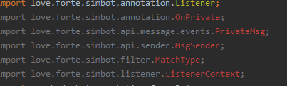

> <small><i>图片中代码是simbot2的，不过效果都是类似的，放在simbot3上也适用</i></small>

如果你发现你的代码所有simbot相关的内容都出现了包引用异常，并且它们的特点是：
- 你实际正常引入了相关的依赖，也可以在依赖树/库中找到对应的类，换言之警告的类实际上是**存在的**。
- 红色警告**附着在类上**，而不是某个包路径节点上。
- 强行运行的话是**可正常运行**的。

那么你可以：

### 1. 更新IDEA

出现这个问题基本可以确定你使用的IDE应该是 **IntelliJ IDEA**。

你需要确保你的IDEA的版本不能太落后，至少要在当前最新版本的三个小版本范围内。举个例子，假如目前IDEA的最新版本为 `2023.1`，那么你现在使用的IDEA至少也得是 `2022.1+`。

:::info 不绝对

**三个小版本范围**的说法其实只是凭感觉，并不绝对。总而言之，IDEA的版本越新越好。

:::

> _理论上来说，eclipse可能不会出现此问题。（其他IDE不了解）_

### 2. 禁用Kotlin插件

如果你真的不想更新IDEA，那么你可以尝试禁用IDEA的 `Kotlin` 插件，如果你不打算也没有使用Kotlin的话。只要你编写的语言不是 `Kotlin`，那么禁用掉此插件也是可以使用simbot的。

> _但是这样也可能使得一些由 `Kotlin` 而来的异常/警告检测失效，比如在 `Java` 中引用 `internal` 级别的类型。_
